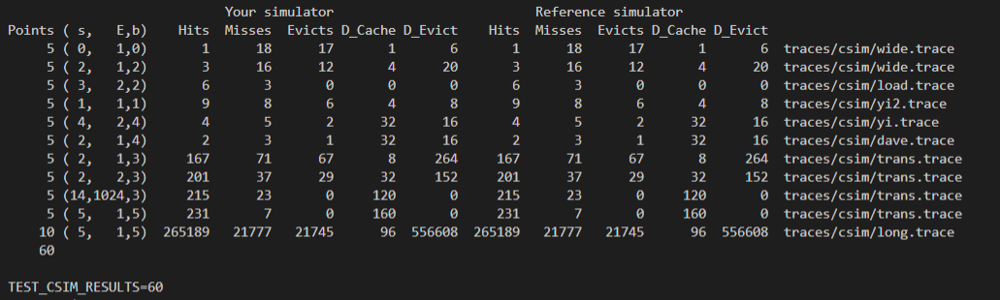

# Cache-Simulator
Intro to Computer Systems assignment. This assignment was built and (supposed to) run in **Linux**.  :

1. [csim.c](csim.c) is a small C program that simulates the behavior of a hardware cache memory


*  Given a series of memory operations, [csim.c](csim.c) simulates the behavior of a cache with arbitrary size and associativity. 


*  It uses the LRU (least-recently used) replacement policy and a write-back, write-allocate policy.

* All the smaple trace files can be found in [traces/csim](traces/csim) for testing the [csim.c](csim.c)


### Usage:


```
Usage: ./csim -s <s> -E <E> -b <b> -t <tracefile>

-s <s>: Number of set index bits (S = 2s is the number of sets) 
-E <E>: Associativity (number of lines per set) 
-b <b>: Number of block bits (B = 2b is the block size) 
-t <tracefile>: Name of the memory trace to replay


For example:
./csim -s 0 -E 1 -b 0 -t traces/csim/wide.trace
```
(The command-line arguments are based on the notation (s, E, and b) from page 617 of the CS:APP3e textbook.)

* The output includes the total number of hits, misses, evictions, the number of dirty bytes that have been evicted and the number of dirty bytes in the cache at the end of the simulation.

For example:

```
hits:4 misses:5 evictions:3 dirty_bytes_in_cache:32 dirty_bytes_evicted:16
```
### Evaluation
To evaluate [csim.c](csim.c), the professor provides us with a Reference Simulator, which grades our program by comparing its output with that of the Reference Simulator. Here's the result of my simulator v.s. Reference Simulator:
<p>
 
</p>
The full points are 60 for this test!

> For each test, it shows the number of points you earned, the cache parameters, the input trace file, and a comparison of the results from your simulator and the reference simulator.


---
2. [trans.c](trans.c) optimizes a `transpose_submit`, a matrix transpose function, with the goal of minimizing the number of cache misses and minimizes the number of clock cycles under several restrictions

* `transpose_submit` computes the transpose of `N`×`M` matrix `A` and store the results in `M`×`N` matrix `B`, where `tmp` is a pointer to an array of 256 elements that can be used to hold data as an intermediate step between reading from `A` and writing to `B`.


* When M = N = 32 or M = N = 1024, `transpose_submit` optimizes a matrix transpose function for the cache; otherwise, it works like a regular matrix transpose function


Usage:


```
 void transpose_submit(size_t M, size_t N, double A[N][M], double B[M][N], double *tmp);
```
### Evaluation
The performance of `transpose_submit` function is evaluated by
using **LLVM-based** instrumentation to extract the address trace, and then using the professor's Reference Simulator to replay this trace on a cache with parameters 
```s = 5, E = 1, b = 6``` for **32 x 32** matrix transportation

Using the reference cache simulator, **a cache miss is worth 100 clock cycles, while a cache hit is worth 4 clock cycles**.


`transpose_submit` has to get no more than 36,000 clocle cycles for **32 x 32** matrix to get the full points. Here's the report for my `transpose_function`:


For the **1024 x 1024** matrix, `transpose_function` will be evaluated on on the Haswell L1 cache with cache parameters ```s = 6, E = 8, b = 6```.  

`transpose_submit` has to get no more than 35,100,000 clocle cycles for **1024 x 1204** matrix to get the full points. Here's the report for my `transpose_function`:


